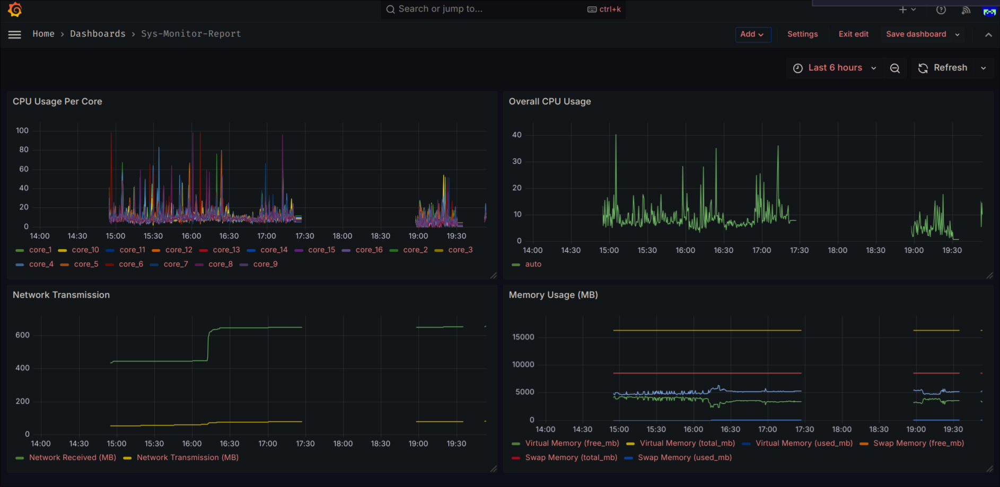

# System Metrics Dashboard with Prometheus and Grafana

A project to monitor system metrics using **Prometheus** and visualize them in **Grafana**. This setup tracks essential system metrics like CPU usage, memory usage, disk I/O, and more.

---

## Features

- Collect system metrics using a custom Go program exposing metrics at `/metrics`.
- Monitor metrics like CPU usage, disk I/O, and memory in Prometheus.
- Visualize metrics using Grafana dashboards.
- Configure and persist dashboards across container restarts.

---

## Visualization



___

## Prerequisites

Make sure you have the following installed:

1. **Docker**: To containerize and run Prometheus and Grafana.
2. **Go**: To run the custom metrics collection program.
3. **curl**: To test Prometheus queries (optional).

---

## Setup Instructions

### Step 1: Clone the Repository
```bash
git clone https://github.com/your-username/your-repo.git
cd your-repo
```

### Step 2: Run the Metric Collection Program

Build and start the Go program that exposes system metrics.

```bash
Build and start the Go program that exposes system metrics.

```bash
go run cmd/main.go
```

This program starts a server on ```http://localhost:8080/metrics``` where Prometheus scrapes data.

### Step 3: Set Up Prometheus

Start the Prometheus container:

```bash
docker run -d \
    --network host \
    -p 9090:9090 \
    -v $(pwd)/config/prometheus.yml:/etc/prometheus/prometheus.yml \
    prom/prometheus
```

Verify Prometheus is running by visiting http://localhost:9090.

### Set Up Grafana

Start the Grafana container with persistent storage:

```bash
docker run -d \
    --network host \
    -p 3000:3000 \
    --name=grafana \
    -v $(pwd)/grafana-data:/var/lib/grafana \
    grafana/grafana
```

Access Grafana at ```http://localhost:3000``` (default credentials: admin / admin).

___

## Usage

- Open the Grafana dashboard at http://localhost:3000.
- View metrics like:
    - CPU Usage
    - Disk I/O
    - Memory Usage

Prometheus queries:
- Get CPU Usage: cpu_usage_percentage
- Get Disk Read Speed: disk_io_read_speed
- Get Disk Write Speed: disk_io_write_speed


